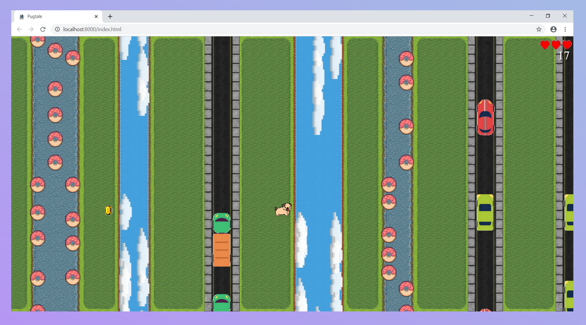
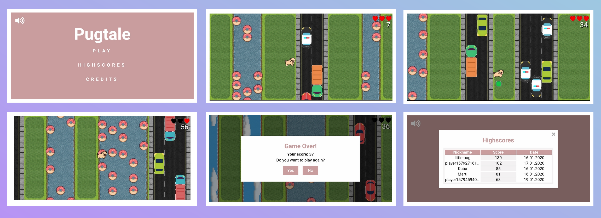

  

<h1 align="center">
	Pugtale
</h1>

> Little platform game with a pug (dog) as a main hero, who goes on an adventure. Playable on both Android and browser.

## Table of contents
* [Introduction](#introduction)
* [Requirements](#requirements)
* [Presentation](#presentation)
* [Features](#features)
* [Technologies](#technologies)
* [Screenshots](#screenshots)
* [Setup](#setup)
* [License](#license)

## Introduction
**Pugtale** is a platform game inspired by the arcade *"Frogger"* game released on the *Atari* and *ZX Spectrum* consoles.
 
The game's style is maintained in **pixelart**, accessible for both younger and older players.
 
The **main hero** is a **puppy**, who faces many dangers during his **adventures**.
 
World extends to the right and consists of several **biomes** (areas) like the **river, streets, sky** (yes, sky is not a limit!) and those where pug can rest for a while. Biomes and their sizes are created **procedurally**, each start of the game creates a new, **unique** world. Each biome consists of a certain number of **tiles** and each tile has a fixed size *48x48 pixels*. Spawned biom adjusts to the height and width of the device on which the game is running. When the pug stands in the middle of the device's width, the new biome is created.
 
Each area has also its own type of **objects**. For the save area it is **powerup** with specific action supporting the pug, for the river it is a **donut-shaped water mattress**, for the sky it is a **fluffy cloud** and finally for the streets it is a **vehicle**, which also consists of a car and a truck of different sizes.
 
An objects spawn in a certain **random** number and when one *disappears*, another one is spawned in its place.
 
Speeding cars should be **passed**, on clouds and donuts we should **jump** on to not to fall into the abyss or into the water. Powerups would be good to collect, receiving support like: **healing**, **extra points** or **insensitivity** for three seconds.
 
In the upper right corner there are a view of the **number of points** and the **number of lives**. The pug has **3 lives** in the form of **hearts**. If he loses all 3, **the game ends**.
 
The game has an unreadable **level**, which increases after exceeding the multiple of 20 points. With each level up the game becomes **adequately more difficult** - friendly biom is **less common**, and those with dangers become **larger** and **wider**.
 
The puppy **earns points** with every step to the right or by finding a **coin** that increases them by 10 points.
 
To move, he needs a help of the *player*, who can **swipe** on Android or **swipe/arrow keys** on a browser, showing him the path to go.
 
The game is filled with dog and object **animations** and informs the player about events in the form of **sounds** and **music** *(on Android also vibration is available)*.
 
After each game our **score** is saved and if we are in the **top 5 players**, our nickname is displayed in the **highscores** table.
 
History of high-scores is stored in a **cloud** *(Cloud Firestore)*.
 
Game is made with **Cordova** which allows to create mobile apps with HTML, CSS and JS.
 
External libraries used in project: [Hammer.js](https://hammerjs.github.io/), [Howler.js](https://howlerjs.com/), [Font Awesome](https://fontawesome.com/), [Firebase](https://www.npmjs.com/package/firebase).
 
Assets are under free access from [opengameart](https://opengameart.org/) or [itch.io](https://itch.io) and asset with pug is made by me under CC0 Public-domain license.
 
An application was tested on *Firefox 72.0.1 (64-bit)*, *Chrome 79.0.3945.117 (64-bit)* and *Android 9.0*.
 
Game does not require network connection to work properly, however to add/upload the score to highscores the network connection is needed.
 
Project was made for passing the classes *"Design of Mobile Games"*.

## Requirements
* Projects can be done in small teams (one or two people)
* Every project has to be stored on bitbucket/github
* Each game has to be working on two types of devices (e.g. phone and tablet)
* Each game should use some external data-source/service/cloud that can store app data (e.g. high-score)
* Each game have to use at least one capability of mobile phone (e.g. accelerometer, shake)
* Each game has to be created using Cordova
* Games cannot use any graphical or game libraries/engines (e.g. velocity)

## Presentation
[Full presentation in PDF](/docs/pugtale-presentation.pdf)

## Features
* Procedural created and respawning world
* Various types of biomes
* Randomly generated objects
* Supporting powerups with different effects
* Different types of dangers
* Swipe/arrows keys movements
* Vibration function
* Fully animated objects
* Ambient sounds
* Leveling with progress
* Highscores stored in cloud database
* Muting music and sounds
* Setting own nickname
* Pixelart style
* Accessible for both younger and older players

## Technologies
* Cordova 9.0.0
* Cordova plugins:
  * cordova-plugin-browsersyncs-gen2 1.1.7
  * cordova-plugin-device 2.0.3
  * cordova-plugin-file 6.0.2
  * cordova-plugin-media 5.0.3
  * cordova-plugin-network-information 2.0.2
  * cordova-plugin-vibration 3.1.1
  * cordova-plugin-whitelist 1.3.4
* [Font Awesome 5.12.0](https://fontawesome.com/)
* [Hammer.js 2.0.8](https://hammerjs.github.io/)
* [Howler.js 2.1.3](https://howlerjs.com/)
* [Firebase 7.6.0](https://www.npmjs.com/package/firebase).

## Screenshots

	

	

  <video width="640" height="304" controls>
    <source src="./www/assets/videos/pugtale-video-1.mp4" type="video/mp4">
    Your browser does not support the video tag.
  </video>

## Setup

## License
This project is licensed under the terms of the Apache License 2.0, all the assets are under the terms of the CC0 Public-domain license from [opengameart](https://opengameart.org/) or [itch.io](https://itch.io) with free access.